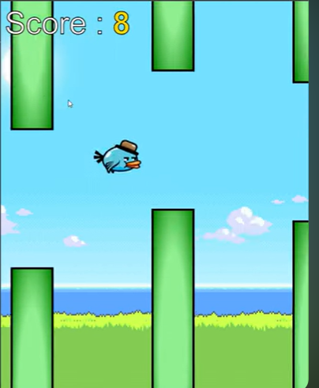

# 🐤 Flappy Bird Game

This is a **simple web game** that recreates the famous **Flappy Bird**.  
You control a small bird and try to **fly between pipes without crashing**.  
Everything in this project is made using **basic web languages** no game engine or special tools.

---

## 🚀 Features

- 🕹️ Smooth gameplay and controls  
- ⚙️ Real-time physics and gravity  
- 🎨 Sprite-based animations  
- 💥 Accurate collision detection  
- 🔊 Integrated sound effects  
- 🧩 Organized and easy-to-understand code structure  
- 📱 Runs in any modern browser  no setup needed
  
---

## 🧠 What Was Used to Make This?

| File | Simple Explanation |
|------------------|-------------------|
| **HTML (`index.html`)**| This is like the **skeleton** of the game it creates the page. |
| **CSS (`style.css`)** | This is the **design** it makes things look nice (colors, layout, etc). |
| **JavaScript (`script.js`)** | This is the **brain** it makes the bird move and the game work. |
| **images/** | Contains pictures used in the game (bird, pipes, background). |
| **sounds/** | Contains sound effects when the bird flaps or hits something. |

---

## 🚀 How to Play 

1. **Download or clone** this project.
2. **Open the file** named `index.html` in any web browser (like Chrome, Firefox, etc).
3. **Press SPACE or click your mouse** to make the bird flap.
4. **Avoid the pipes** — if you hit them or fall, you lose.

> ✅ **No installation needed — it runs instantly.**

---

## 🎮 Game Controls

| Action      | How to Do It                |
|-------------|----------------------------|
| Start / Flap | Press **SPACE** or **Click/Tap** |
| Restart      | Just **refresh the page** |

